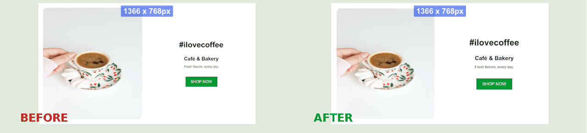

# rollup-plugin-responsive-app [beta]
A Rollup plugin to automatically handle your app responsiveness:

* Set up and ready
* Major frontend frameworks compatible
* Web accessible compliant
* Mobile screen auto-adaptation [experimental]

## Demo
The plugin will make sure the app proportions are the same across all screen resolutions:



## Install

```javascript
npm i -D rollup-plugin-responsive-app
```

## Usage

In your `rollup.config.js` or `vite.config.js` file:

```javascript
import responsive from 'rollup-plugin-responsive-app'

export default {
  ...
  plugins: [
    ...,
    // Last plugin on the list
    responsive()
  ],
};
```

## Options

You can pass an object with options to `responsive({...})`:

| Name  | Type | Description | Default | 
| ------------- |:-------------:| ------------- |:-------------:|
| appEntry  | undefined \| string | Your application entry point | Will try to resolve as `index.html`, `app.js`, `main.js` or `src/index.js` | 
| transformPixels  | boolean \| TransformPixelsOptions | Convert `pixel` definitions to `rem` | true | 
| handleMobile  | boolean \| HandleMobileOptions | Auto-adapt the interface for mobile screens [experimental] | true |

#### TransformPixelsOptions

| Name  | Type | Description | Default | 
| ------------- |:-------------:| ------------- |:-------------:|
| ignoreAttributes  | string[] | List of CSS attributes to be bypassed. You can set as `['box-shadow', 'border-radius']` for example | [] | 
| ignoreSelectors  | string[] | List of CSS selectors to be bypassed| [] | 

#### HandleMobileOptions

| Name  | Type | Description | Default | 
| ------------- |:-------------:| ------------- |:-------------:|
| ignoreSelectors  | string[] | List of CSS selectors to be bypassed| [] | 
| centralizeText | string[] | List of elements to be centralized | ['h1', 'h2', 'h3', 'h4', 'h5', 'h6', 'p'] |
| breakpoint | string | Max screen width (when to consider as "mobile") | 480px


#### Bypassing transformations

You can also add the `ignore-responsive-app` class to any HTML element so the above transformations do not have effect. Example:

```HTML
<div class="width-300px ignore-responsive-app">
  My width will remain in pixels!
</div>
```

## Beta phase

The plugin currently sits on the beta version. Test it on your fresh app and open a Github issue if it is not working on your context.